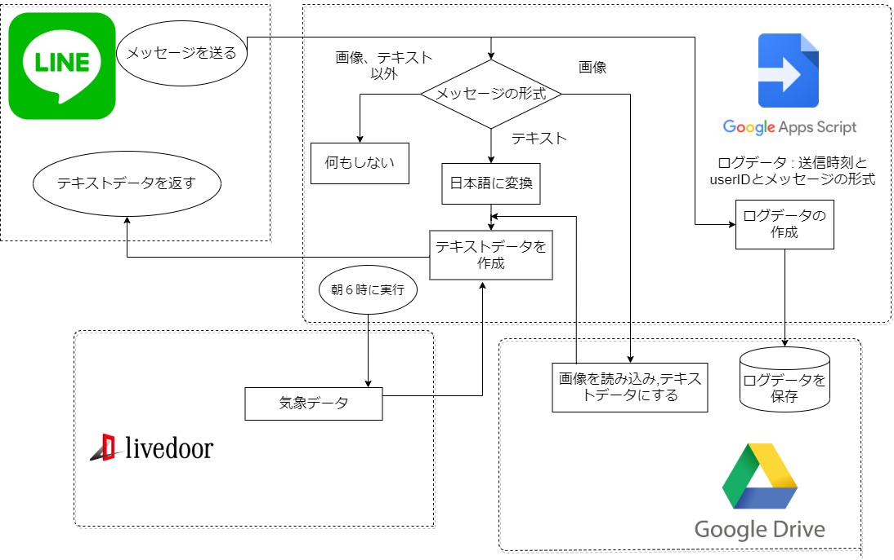

# LINEのBotを作成した
## 作成したLINEBotの機能
- 日本語を送るとオウム返しする
- 英語を送ると日本語に翻訳して返す
- 文字の写った画像を送ると文字をテキストとして返す
- 今日の天気を決まった時間に通知する

## なぜ作ったのか
先輩が文字起こしBotを作っていて、簡単と言われたので自分でも作ってみることにしました。

## 使用した技術
- GAS(Google Apps Script)
- LINE
- Google Drive (ログ保存用)
- livedoor (天気用)

## 作成したボットの動作フロー

## 参考にしたサイト
- [Google Apps Scriptで画像の文字列を抜き出す](https://qiita.com/ttake/items/77f25a9c357ff2327868)
- [Google Apps Script 入門](https://qiita.com/t_imagawa/items/47fc130a419b9be0b447)
- [LINE Developpers](https://developers.line.biz/ja/services/messaging-api/)
- [Google Apps Script(GAS)を用いてLINE Botが受信した情報をSlackに送る](https://okawa.routecompass.net/gas-line-slack/#i-13)
- [LineBotを使用してOCRで画像を文字にしてみる](http://newtechnologylifestyle.net/linebotocr/)
- [Google Apps Script試行錯誤Blog](https://www.pre-practice.net/2018/01/blog-post_17.html)
- [【LINE Botの作り方】Messaging API × GAS(Google Apps Script)でおうむ返しボットを作成する](https://www.takeiho.com/messaging-api-gas)
- [Google Apps ScriptでのDateオブジェクトの各生成方法、日付と時刻を分ける](https://tonari-it.com/gas-date-object/)
- [Googleドキュメントにアクセスする (1/6)](http://libro.tuyano.com/index3?id=675001)